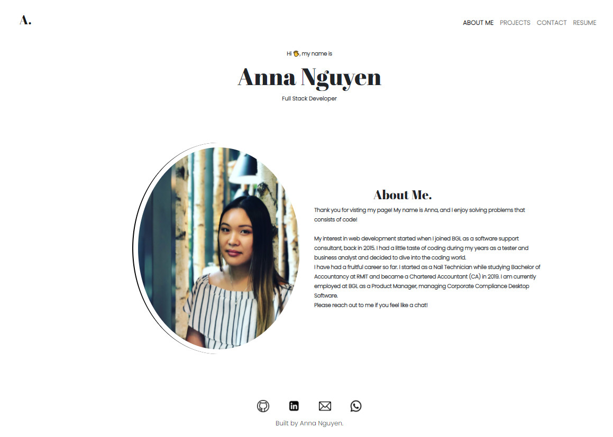

# React Portfolio

## Table Of Contents

- [Description](#description)
- [Installation Instructions](#installation-instructions)
- [Usage Information](#usage-information)
- [Link to Application](#link-to-application)
- [Questions](#questions)

## Description

My portfolio is created using React, a single page application.Create-React-App was used to deploy onto GitHub Pages.

## Installation Instructions

To install necessary dependencies, run the following command(s):

```bash
npm i inquirer
```

Run `npm run start` in the terminal to run the app in development mode and view on local host.

## Usage Information



## Link To Application

Deployed Application:

## Questions

If you have any questions about the repo, please open an issue or contact me directly at n.annabich@gmail.com. You can find more of my work <a href="https://github.com/AnnaNguyen1" target="_blank">here</a>.
